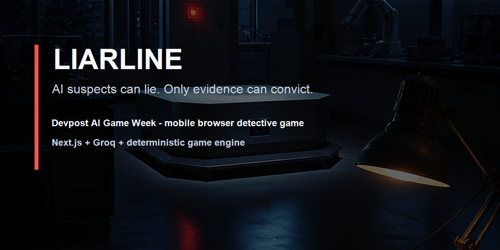
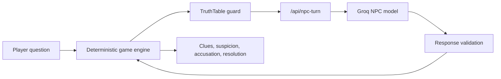

# Liarline

AI suspects can lie. Only evidence can convict.

Liarline is a mobile-browser social deduction detective game built for Devpost AI Game Week. The AI performs suspect dialogue, while a deterministic game engine keeps the culprit, motive, clue unlocks, accusation result, and win/loss logic under local control.

[Playable release](https://liarline.vercel.app) · [Devpost draft](docs/SUBMISSION.md) · [Architecture](docs/GAME_ARCHITECTURE.md) · [Final judge packet](docs/JUDGE_FINAL_PACKET_2026-05-08.md)



## Judge Snapshot

| Surface | Current state |
|---|---|
| Contest scope | One polished playable detective case |
| Platform | Mobile browser, no install |
| AI role | Live NPC dialogue performer |
| Game authority | Deterministic client-side rules decide truth, evidence, and outcome |
| Model path | Server-side Groq proxy, no browser secrets |
| Offline resilience | Role-aware fallback answers keep the flow playable |
| Languages | English and Russian dictionaries with saved locale |

## What It Does

- Starts directly in a compact interrogation interface.
- Lets the player question four suspects with different pressure behavior.
- Uses Groq `llama-3.1-8b-instant` for short suspect answers.
- Keeps the hidden truth table out of the live AI prompt.
- Unlocks clues, contradictions, suspicion changes, accusation scoring, and resolution through deterministic engine rules.
- Saves progress in LocalStorage.
- Provides safe fallback answers when the AI provider is unavailable, rate-limited, or returns invalid output.

## Why It Matters

Most AI game prototypes let the model act like the whole game master. Liarline uses AI where it is strongest, as an improvising character actor, and uses deterministic state where fairness matters. The player wins by proving the case with evidence, not by trusting whatever a model says.

## Quickstart

```bash
npm install
npm run dev
```

Open the local URL printed by Next.js.

For live AI interrogation, copy `.env.example` to `.env.local` and add a server-only Groq key:

```bash
GROQ_API_KEY=your_key_here
```

Optional backup keys can be added on the server only:

```bash
GROQ_API_KEYS=your_key_here,your_key_here
# or:
GROQ_API_KEY_1=your_key_here
GROQ_API_KEY_2=your_key_here
GROQ_API_KEY_3=your_key_here
```

Without a valid key, the game still runs through guarded fallback answers. Do not describe a fallback-only recording as live AI in a contest demo.

## Verification

Core gates:

```bash
npm run build
npm run test:game-engine
npm run test:npc-turn
npm run test:demo-route
npm run test:win-push-phase1
npm run test:win-push-phase1-readiness
npm run test:win-push-phase2-ai-quality
npm run test:win-push-phase2-quarantine
npm run test:win-push-phase3-provider-proof
npm run test:win-push-phase4-mobile-ux
npm run test:win-push-phase5-visual-dna
npm run test:win-push-phase6-qa
npm run test:win-push-phase7-submission
npm run test:win-push-phase8-postlaunch
npm run test:ui-copy
npm run test:mobile-ui
npm run test:visual-dna
npm run test:visual-assets
npm run test:contest-final-packet
npm run test:judge-readiness
npm run test:release-postlaunch
```

Full release and win-push gates are documented in [docs/RELEASE.md](docs/RELEASE.md) and [docs/MASTER_TODO.md](docs/MASTER_TODO.md).
The current win-push suite includes AI quarantine, provider proof, mobile UX, visual DNA, QA, submission, and post-launch readiness checks.

## Feedback intake

The resolution screen includes a local feedback intake panel for AI quality, missed contradictions, notebook clarity, unfair accusation reports, mobile bugs, and localization issues. Feedback remains local and is used as a post-launch readiness signal.

## AI Boundary

The model is an actor, not the judge.



The live NPC request includes only public case facts, the active suspect profile, that suspect's allowed knowledge, recent local transcript, and strict output rules. It does not include the hidden culprit, true motive, full truth table, or global timeline.

## Demo Route

The reproducible judge path is covered by `npm run test:demo-route`:

1. Open the game on a phone-width viewport.
2. Ask the first suspect about the camera failure.
3. Show the first AI answer with concrete case detail.
4. Trigger the camera-vs-cart contradiction.
5. Show Ivo's pressure shift.
6. Open the notebook and show the contradiction/evidence record.
7. Accuse with suspect, motive, and evidence.
8. Show the final resolution and detective rating.

## Project Map

| Path | Purpose |
|---|---|
| `src/app/` | Next.js App Router shell and `/api/npc-turn` route wrapper |
| `src/components/` | Mobile game screens and shared UI |
| `src/game/` | Deterministic game state, seed case, rules, clue contracts, visual logic |
| `src/ai/` | NPC prompt contracts, validation, and fallback logic |
| `src/state/GameStore.tsx` | LocalStorage-backed client store |
| `src/i18n/dictionaries.ts` | English/Russian UI and case copy |
| `docs/GAME_ARCHITECTURE.md` | Engine, AI, and state contracts |
| `docs/SUBMISSION.md` | Devpost copy and demo script |
| `docs/SUBMISSION_PACKAGE.md` | Submission proof packet and strict readiness notes |
| `docs/GITHUB_PACKAGING_AUDIT.md` | GitHub packaging audit, file matrix, and metadata checklist |

## Current Scope Guardrail

This repository describes one playable case honestly. It must not claim a playable multi-case season, multiplayer, voice/video interrogation, accounts, unlimited generated cases, or a full trial system as current functionality.

## Contributing And Support

This is a contest/demo repository. Small fixes, documentation improvements, and reproducible bug reports are welcome, but the current priority is keeping the one-case Devpost build stable and honest.

- Contribution guide: [CONTRIBUTING.md](CONTRIBUTING.md)
- Support policy: [SUPPORT.md](SUPPORT.md)
- Security policy: [SECURITY.md](SECURITY.md)
- Change history: [CHANGELOG.md](CHANGELOG.md)

## License

This repository is published for Devpost judging and portfolio review. It is not currently licensed as open source. See [LICENSE](LICENSE) for the current source-available viewing terms.
